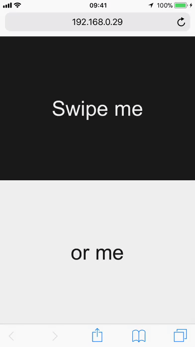

# swiped-events

[](https://www.npmjs.com/package/swiped-events)

A **1k** script that adds `swiped-left`, `swiped-right`, `swiped-up` and `swiped-down` events to the DOM using [CustomEvent](https://developer.mozilla.org/en-US/docs/Web/API/CustomEvent/CustomEvent) and pure JS. Based on the StackOverflow thread [Detect a finger swipe through JavaScript on the iPhone and Android](https://stackoverflow.com/questions/2264072/detect-a-finger-swipe-through-javascript-on-the-iphone-and-android)



## Usage

Add [swiped-events.min.js](dist/swiped-events.min.js) to your page and start listening for swipe events. Events bubble, so you can `addEventListener` at document level, or on individual elements.

### swiped

```js
document.addEventListener('swiped', function(e) {
  console.log(e.target); // element that was swiped
  console.log(e.detail); // see event data below
  console.log(e.detail.dir); // swipe direction
});
```

### swiped-left

```js
document.addEventListener('swiped-left', function(e) {
  console.log(e.target); // element that was swiped
  console.log(e.detail); // see event data below
});
```

### swiped-right

```js
document.addEventListener('swiped-right', function(e) {
  console.log(e.target); // element that was swiped
  console.log(e.detail); // see event data below
});
```

### swiped-up

```js
document.addEventListener('swiped-up', function(e) {
  console.log(e.target); // element that was swiped
  console.log(e.detail); // see event data below
});
  ```

### swiped-down

```js
document.addEventListener('swiped-down', function(e) {
  console.log(e.target); // element that was swiped
  console.log(e.detail); // see event data below
});
```

### event data

The following event data is included with every event and accessible via `e.detail`

```js
{
  dir: 'up',            // swipe direction (up,down,left,right)
  touchType: 'direct',  // touch type (stylus,direct) - stylus=apple pencil and direct=finger
  xStart: 196,          // x coords of swipe start
  fingers: 1,           // number of fingers used
  xEnd: 230,            // x coords of swipe end
  yStart: 196,          // y coords of swipe start
  yEnd: 4               // y coords of swipe end
}
```

### Configure

You can _optionally_ configure how [swiped-events](https://github.com/john-doherty/swiped-events) works using the following HTML attributes:

| Attribute              | Description                                                                          | Type      | Default |
|------------------------|--------------------------------------------------------------------------------------|-----------|---------|
| `data-swipe-threshold` | Number of *pixels* or *percent of viewport-axis* a user must move before swipe fires | _integer_ | 20      |
| `data-swipe-unit`      | *Unit* of the threshold (can be either "px", "vh" or "vw")                           | _string_  | "px"    |
| `data-swipe-timeout`   | Number of *milliseconds* from `touchstart` to `touchend`                             | _integer_ | 500     |
| `data-swipe-ignore`    | If *true*, swipe events on this element are ignored                                  | _boolean_ | _false_ |

If you do not provide any attributes, it assumes the following:

```html
<div data-swipe-threshold="20"
     data-swipe-unit="px"
     data-swipe-timeout="500"
     data-swipe-ignore="false">
     Swiper, get swiping!
</div>
```

To set defaults application wide, set config attributes on a parent/topmost element:

```html
<body data-swipe-threshold="50" data-swipe-unit="vw" data-swipe-timeout="250">
    <div>Swipe me</div>
    <div>or me</div>
</body>
```

## Contributing

1. Fork it!
2. Create your feature branch: `git checkout -b my-new-feature`
3. Commit your changes: `git commit -m 'Add some feature'`
4. Push to the branch: `git push origin my-new-feature`
5. Submit a pull request

### Development

The project includes everything needed to tweak, including a node webserver. Run the following, then visit [http://localhost:8080](http://localhost:8080) in your browser.

_You can test on a desktop using [Device Mode](https://developers.google.com/web/tools/chrome-devtools/device-mode/) in Google Chrome._

```bash
git clone https://github.com/john-doherty/swiped-events
cd swiped-events
npm install
npm start
```

### Update .min files

To create a new version of the minified [swiped-events.min.js](dist/swiped-events.min.js) file from source, tweak the version number in `package.json` and run the following:

```bash
npm run build
```

## Star the repo

If you find this useful, please star the repo. It helps me priorities which OSS issues to tackle first 🙌

## History

For change-log, check [releases](https://github.com/john-doherty/swiped-events/releases).

## License

Licensed under [MIT License](LICENSE) &copy; [John Doherty](https://twitter.com/mrjohndoherty)
